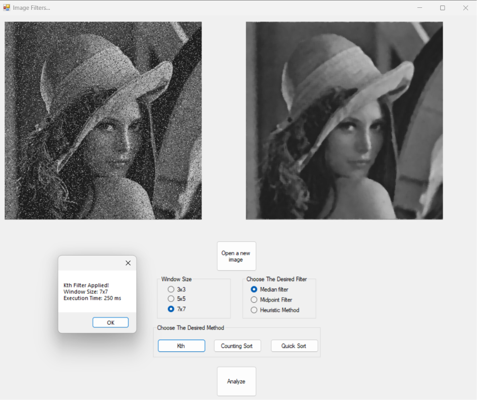
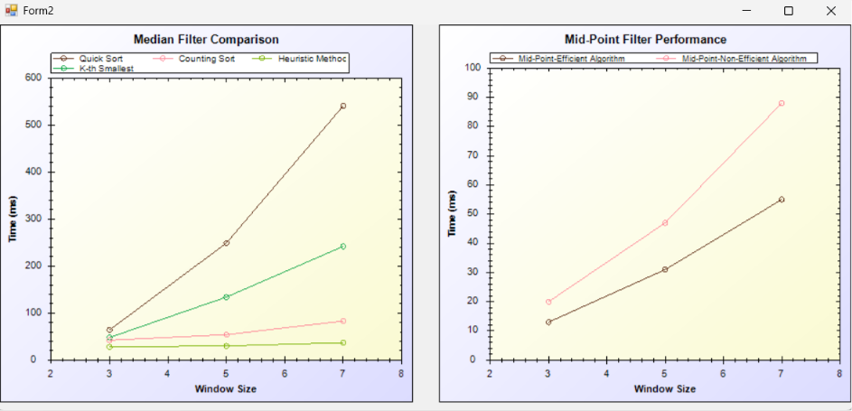

# Image Processing & Filter Performance Analyzer

An interactive **WinForms (C#)** desktop application designed to apply advanced image filtering algorithms and analyze their execution performance under various window sizes ($3 \times 3$, $5 \times 5$, and $7 \times 7$). The project integrates custom implementations of sorting-based, selection-based, and sliding-window algorithms and compares them in real-time using graphical plots.

---

## 📸 Application Preview

### Main Interface & Filtering Demo
Applying the **K-th Smallest** median filter on the iconic Lena image:

### Performance Comparison Graphs
Comparing the execution times (in milliseconds) of all algorithms over different window sizes using **ZedGraph**:

---

## 🚀 Key Features

### 1. Median Filtering Methods
* **Quick Sort:** Applies a standard median filter by sorting all pixel values within the window using Quick Sort.
* **Counting Sort:** An optimized median filter utilizing counting sort principles for improved time complexity on small pixel ranges.
* **Heuristic Method:** A highly efficient sliding window technique that minimizes redundant calculations as the filtering window moves across the image.
* **K-th Smallest (QuickSelect):** Uses the selection algorithm to directly locate the median pixel value without fully sorting the window array.

### 2. Midpoint Filtering Methods
* **Efficient Midpoint Filter:** Rapidly computes the midpoint value $(\frac{\text{Min} + \text{Max}}{2})$ across active windows.
* **Non-Efficient Midpoint Filter:** A baseline implementation used to benchmark and highlight performance differences.

### 3. Real-Time Performance Analytics
* Triggered by the **Analyze** button.
* Automatically benchmarks and times each selected filter over $3 \times 3$, $5 \times 5$, and $7 \times 7$ window configurations.
* Generates interactive, side-by-side performance comparison curves using the **ZedGraph** library.

---

## 🛠️ Setup & Prerequisites

For you and your colleagues to run this project smoothly on any Windows machine, please follow these steps:

### 1. Requirements
* **IDE:** [Visual Studio 2022](https://visualstudio.microsoft.com/) (or newer)
* **SDK:** **.NET Framework 4.8 Developer Pack** 
  *(If you do not have it, open the Visual Studio Installer $\rightarrow$ click Modify $\rightarrow$ select Individual Components tab $\rightarrow$ search for `.NET Framework 4.8 targeting pack` or `.NET Framework 4.8 SDK` and install it).*

### 2. Unblock the ZedGraph Library
Windows occasionally blocks `.dll` files downloaded from GitHub for security reasons. To ensure the graphing controls load successfully:
1. Navigate to the `/ImageFilters/bin/Debug/` folder in this repository.
2. Right-click **`ZedGraph.dll`** and select **Properties**.
3. In the **General** tab, check the **Unblock** box at the bottom (if present) and click **Apply** / **OK**.

---

## 💻 How to Run
1. Clone or download this repository.
2. Open the **`ImageFilters.sln`** solution in Visual Studio.
3. Build and run the project by pressing **F5** or clicking the **Start** button in Visual Studio.
4. Click **Open a new image** to load your image.
5. Select your desired window size and algorithm, then click **Apply** to filter your image!
6. Click **Analyze** to generate the real-time performance graphs.
